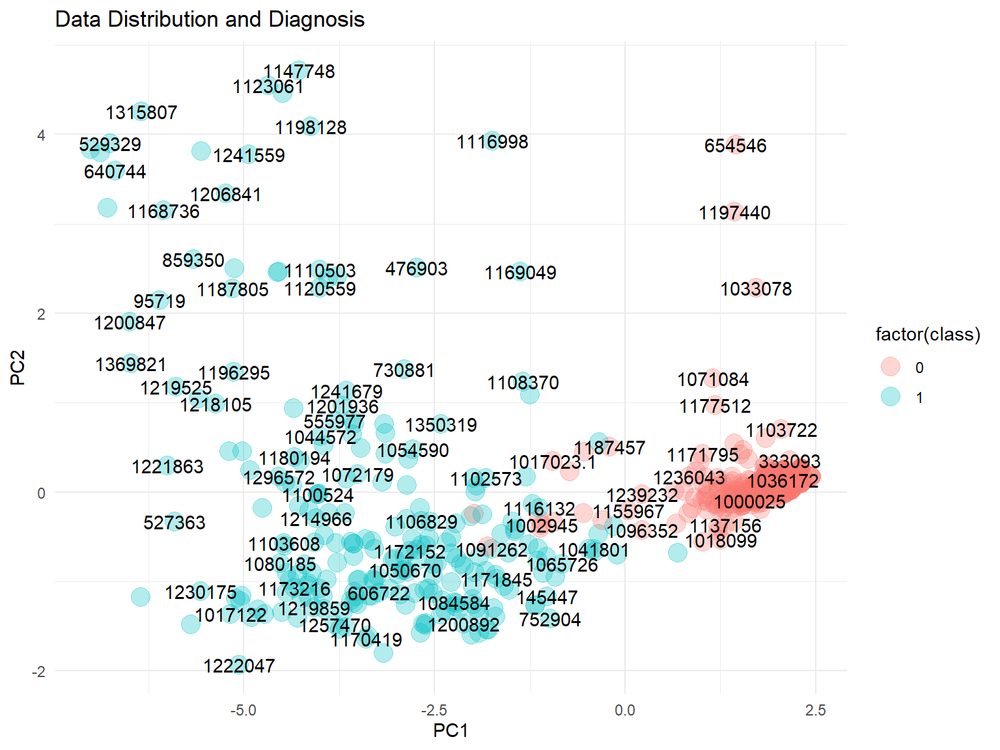
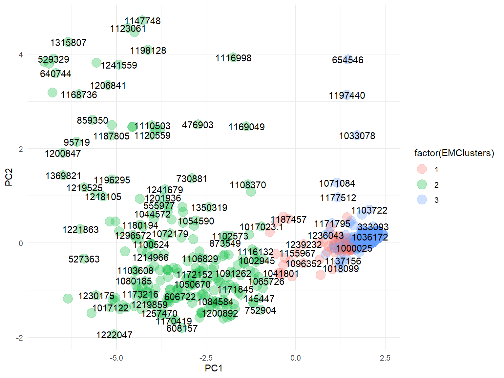

Outlier Detection
================
[Hendrik Mischo](https://github.com/hendrik-mischo)
09 May 2020

# Objective

The objective of this project is to detect anomalies, i.e. patterns that
do not conform to “normal” behavior, in a dataset of breast cancer
biopsies. We will use the Mahalanobis Distance as an outlier detection
method as well as two common clustering algorithms: DBSCAN and
Expectation Maximization. Finally, we will compare the results and
highlight the strengths and weaknesses of each approach.

# Data Exploration & Cleaning

The dataset was downloaded from UCI machine learning repositories. It
includes 699 examples of cancer biopsies, each with the following
features:

  - Sample code number
  - Clump Thickness
  - Uniformity of Cell Size
  - Uniformity of Cell Shape
  - Marginal Adhesion
  - Single Epithelial Cell Size
  - Bare Nuclei
  - Bland Chromatin
  - Normal Nucleoli
  - Mitoses

There is also a class label indication the diagnosis coded as M
(malignant) or B (benign).

Looking at the feature names, the features seem to relate to the shape
and size of the cell nuclei. However, it would require domain knowledge
to understand how each of them relate to the cancer diagnosis.

Let’s start by importing the relevant libraries.

``` r
library(tidyverse)  # Data wrangling
library(data.table) # Data tables
library(MVN)        # Multivariate outlier detection
library(dbscan)     # DBSCAN
library(mclust)     # Expectation Maximization
```

Let’s import the data and take a look at its structure.

``` r
data = read.table("breast-cancer-wisconsin.data", sep = ",",
                  col.names = c("id", "clump_thickness", "uniform_cell_size", "uniform_cell_shape", 
                                "marginal_adhesion", "single_epithelial_cell_size", "bare_nuclei", 
                                "bland_chromatin", "normal_nucleoli", "mitoses", "class"
                                )
                  )
summary(data)
```

``` 
       id           clump_thickness  uniform_cell_size uniform_cell_shape
 Min.   :   61634   Min.   : 1.000   Min.   : 1.000    Min.   : 1.000    
 1st Qu.:  870688   1st Qu.: 2.000   1st Qu.: 1.000    1st Qu.: 1.000    
 Median : 1171710   Median : 4.000   Median : 1.000    Median : 1.000    
 Mean   : 1071704   Mean   : 4.418   Mean   : 3.134    Mean   : 3.207    
 3rd Qu.: 1238298   3rd Qu.: 6.000   3rd Qu.: 5.000    3rd Qu.: 5.000    
 Max.   :13454352   Max.   :10.000   Max.   :10.000    Max.   :10.000    
                                                                         
 marginal_adhesion single_epithelial_cell_size  bare_nuclei  bland_chromatin 
 Min.   : 1.000    Min.   : 1.000              1      :402   Min.   : 1.000  
 1st Qu.: 1.000    1st Qu.: 2.000              10     :132   1st Qu.: 2.000  
 Median : 1.000    Median : 2.000              2      : 30   Median : 3.000  
 Mean   : 2.807    Mean   : 3.216              5      : 30   Mean   : 3.438  
 3rd Qu.: 4.000    3rd Qu.: 4.000              3      : 28   3rd Qu.: 5.000  
 Max.   :10.000    Max.   :10.000              8      : 21   Max.   :10.000  
                                               (Other): 56                   
 normal_nucleoli     mitoses           class     
 Min.   : 1.000   Min.   : 1.000   Min.   :2.00  
 1st Qu.: 1.000   1st Qu.: 1.000   1st Qu.:2.00  
 Median : 1.000   Median : 1.000   Median :2.00  
 Mean   : 2.867   Mean   : 1.589   Mean   :2.69  
 3rd Qu.: 4.000   3rd Qu.: 1.000   3rd Qu.:4.00  
 Max.   :10.000   Max.   :10.000   Max.   :4.00  
                                                 
```

``` r
head(data, 10)
```

``` 
        id clump_thickness uniform_cell_size uniform_cell_shape
1  1000025               5                 1                  1
2  1002945               5                 4                  4
3  1015425               3                 1                  1
4  1016277               6                 8                  8
5  1017023               4                 1                  1
6  1017122               8                10                 10
7  1018099               1                 1                  1
8  1018561               2                 1                  2
9  1033078               2                 1                  1
10 1033078               4                 2                  1
   marginal_adhesion single_epithelial_cell_size bare_nuclei bland_chromatin
1                  1                           2           1               3
2                  5                           7          10               3
3                  1                           2           2               3
4                  1                           3           4               3
5                  3                           2           1               3
6                  8                           7          10               9
7                  1                           2          10               3
8                  1                           2           1               3
9                  1                           2           1               1
10                 1                           2           1               2
   normal_nucleoli mitoses class
1                1       1     2
2                2       1     2
3                1       1     2
4                7       1     2
5                1       1     2
6                7       1     4
7                1       1     2
8                1       1     2
9                1       5     2
10               1       1     2
```

From the dataset description we know that there are 16 instances in
`bare_nuclei` that contain a single missing (i.e., unavailable)
attribute value, denoted as “?”. Moreover, we can see that there are
duplicate IDs, however eventhough the entries have the same IDs, the
feature values may be different.

We will perform the following mutations to the data:

  - Remove missing values
  - Encode class label as binary (0 = B, 1 = M)
  - Append a counter to duplicate IDs to make them unique
  - Remove `id` column and set them as row names instead
  - Scale the data so that each feature contributes equally

<!-- end list -->

``` r
data = data %>% 
  filter(!bare_nuclei == "?") %>%                               
  mutate(bare_nuclei = as.numeric(as.character(bare_nuclei)),   
         class = ifelse(class == 4, 1, 0),
         class = as.integer(class),
         id = make.unique(as.character(id)))                         
row.names(data) = data$id
data = data[,names(data) != "id"]
data_ = as.data.frame(scale(data))
summary(data_)
```

``` 
 clump_thickness   uniform_cell_size uniform_cell_shape marginal_adhesion
 Min.   :-1.2203   Min.   :-0.7017   Min.   :-0.7412    Min.   :-0.6389  
 1st Qu.:-0.8658   1st Qu.:-0.7017   1st Qu.:-0.7412    1st Qu.:-0.6389  
 Median :-0.1568   Median :-0.7017   Median :-0.7412    Median :-0.6389  
 Mean   : 0.0000   Mean   : 0.0000   Mean   : 0.0000    Mean   : 0.0000  
 3rd Qu.: 0.5523   3rd Qu.: 0.6033   3rd Qu.: 0.5972    3rd Qu.: 0.4084  
 Max.   : 1.9703   Max.   : 2.2345   Max.   : 2.2702    Max.   : 2.5029  
 single_epithelial_cell_size  bare_nuclei      bland_chromatin  
 Min.   :-1.0050             Min.   :-0.6983   Min.   :-0.9981  
 1st Qu.:-0.5552             1st Qu.:-0.6983   1st Qu.:-0.5899  
 Median :-0.5552             Median :-0.6983   Median :-0.1817  
 Mean   : 0.0000             Mean   : 0.0000   Mean   : 0.0000  
 3rd Qu.: 0.3444             3rd Qu.: 0.6738   3rd Qu.: 0.6347  
 Max.   : 3.0434             Max.   : 1.7716   Max.   : 2.6758  
 normal_nucleoli      mitoses            class        
 Min.   :-0.6125   Min.   :-0.3481   Min.   :-0.7331  
 1st Qu.:-0.6125   1st Qu.:-0.3481   1st Qu.:-0.7331  
 Median :-0.6125   Median :-0.3481   Median :-0.7331  
 Mean   : 0.0000   Mean   : 0.0000   Mean   : 0.0000  
 3rd Qu.: 0.3703   3rd Qu.:-0.3481   3rd Qu.: 1.3620  
 Max.   : 2.3358   Max.   : 4.8461   Max.   : 1.3620  
```

# Dimensionality Reduction

When many variables are present, it is impossible to plot the data so it
is difficult to get a sense of the underlying trends. We can reduce
dimensionality by performing perform principal component analysis (PCA).

PCA allows us to see the overall “shape” of the data, identifying which
observations are similar to one another and which are very different.

``` r
pca = prcomp(data_[,1:10])
summary(pca)
```

    Importance of components:
                              PC1     PC2    PC3     PC4     PC5     PC6    PC7
    Standard deviation     2.5945 0.89059 0.7389 0.68213 0.61675 0.55906 0.5441
    Proportion of Variance 0.6731 0.07932 0.0546 0.04653 0.03804 0.03125 0.0296
    Cumulative Proportion  0.6731 0.75243 0.8070 0.85356 0.89160 0.92285 0.9525
                               PC8     PC9    PC10
    Standard deviation     0.51110 0.35545 0.29646
    Proportion of Variance 0.02612 0.01263 0.00879
    Cumulative Proportion  0.97858 0.99121 1.00000

We have obtained 10 principal components (PCs) each explaining a certain
percentage of the total variation of the data. From the cumulative
proportion of explained variance, we see that *PC1* and *PC2* alone
explain about 75% of the information in the dataset. Hence, by knowing
the position of an example relative to just these two principal
components, we can get a good idea of where it stands in relation to
other examples.

Let’s prepare the data for plotting.

``` r
embedding = data.table(pca$x[, 1:2])
embedding[, entry := rownames(data_)]
embedding[, class := data$class]
head(embedding)
```

``` 
         PC1         PC2   entry class
1:  1.632138 -0.10110899 1000025     0
2: -1.091952 -0.36764796 1002945     0
3:  1.747215 -0.06835623 1015425     0
4: -1.123580 -0.30561252 1016277     0
5:  1.517047 -0.06200488 1017023     0
6: -5.173918 -1.36302344 1017122     1
```

Let’s plot the data in terms of *PC1* and *PC2*. We color-code the
observations by the class label, so that we can see which ones are
cancer patiens and which are not.

``` r
ggplot(embedding, aes(x = PC1, y = PC2)) +
  geom_point(aes(colour = factor(class)), size = 5, alpha = 0.3) +
  geom_text(aes(label = entry), check_overlap = TRUE) +
  ggtitle("Data Distribution and Diagnosis") +
  theme_minimal()
```



The two groups are separated quite clearly, which indicates that cancer
patients and non-cancer patients have rather different characteristics
with respect to the features. We also see that the non-cancer group is
significantly more dense than the cancer group. This means that people
who do not have the cancer are rather similar and among the cancer
group, people can be relatively different.

# Outlier Detection

With the principal components we derived in the previous section we can
now apply different outlier detection algorithms and visualize and
compare the results.

## Mahalanobis Distance

Let’s explore the Mahalanobis distance outlier detection method for this
example. The Mahalanobis distance is a measure of the distance between a
point P and a distribution D. It is a multi-dimensional generalization
of the idea of measuring how many standard deviations away P is from the
mean of D.

``` r
results_mvn = MVN::mvn(data = data_, mvnTest = "hz",
                       univariateTest = "AD", univariatePlot = "histogram",
                       multivariatePlot = "qq", multivariateOutlierMethod = "quan",
                       showOutliers = TRUE)
```


With this method we obtain 325 outliers, which is a lot given that it is
almost half the dataset. However, the advantage of this technique is
that it allows us to distinguish between less significant and more
significant outliers. From the histograms we see that the vast majority
of observations fall into one bin and the density falls off very quickly
for most variables. However, for some variables, `bare_nuclei` for
example, there is a significant proportion of observations that have an
extremely high value on a particular feature.

Let’s plot the outliers we identified.

``` r
outliers_mah = data.table(entry = rownames(results_mvn$multivariateOutliers), 
                          MahalanobisOutlier = results_mvn$multivariateOutliers$Outlier)
outliers_mah = merge(embedding, outliers_mah, by = "entry")

ggplot(outliers_mah, aes(x = PC1, y = PC2)) +
  geom_point(size = 5, color = "red", alpha = 0.3) +
  geom_text(aes(label = as.character(outliers_mah$entry)), check_overlap = TRUE) +
  ggtitle("Mahalanobis Outliers") +
  theme_minimal() 
```


This plot looks rather similar to the overall distribution of the data.
It appears that MD found outliers across the board with no particular
location with respect to *PC1* and *PC2*. This is not surprising given
that it identified half the dataset as outliers.

## DBSCAN

DBSCAN is a density-based clustering algorithm that takes two
parameters: the neighbourhood (eps) and the search radius for each point
(minPts). The algorithm finds clusters by grouping those points that are
density-reachable from each other into equal clusters. Those points that
cannot be assigned to a clusters given the parameters are considered
outliers.

``` r
dbs1 = dbscan(data_, eps = 1, minPts = 3)
dbs1
```

    DBSCAN clustering for 683 objects.
    Parameters: eps = 1, minPts = 3
    The clustering contains 3 cluster(s) and 266 noise points.
    
      0   1   2   3 
    266 411   3   3 
    
    Available fields: cluster, eps, minPts

We obtained 266 outliers and 3 clusters. This result may not be too
interesting for us because we still have too many outliers and 2 of the
three clusters are nearly empty. The algorithm is highly sensitive to
changes in parameters, so let’s see how the result changes if we
increase the search radius and minimum number of points slightly.

``` r
dbs2 = dbscan(data_, eps = 2, minPts = 4)
dbs2
```

    DBSCAN clustering for 683 objects.
    Parameters: eps = 2, minPts = 4
    The clustering contains 2 cluster(s) and 55 noise points.
    
      0   1   2 
     55 438 190 
    
    Available fields: cluster, eps, minPts

This result is a lot more interesting. We obtained 55 outliers, which is
a lot more manageable than two large clusters. Let’s add the clusters to
our PCA data frame and plot them.

``` r
embedding[, DClusters := dbs2$cluster]
head(embedding)
```

``` 
         PC1         PC2   entry class DClusters
1:  1.632138 -0.10110899 1000025     0         1
2: -1.091952 -0.36764796 1002945     0         0
3:  1.747215 -0.06835623 1015425     0         1
4: -1.123580 -0.30561252 1016277     0         0
5:  1.517047 -0.06200488 1017023     0         1
6: -5.173918 -1.36302344 1017122     1         2
```

``` r
ggplot(embedding, aes(x = PC1, y = PC2)) +
  geom_point(aes(colour = factor(DClusters)), size = 5, alpha = 0.3) +
  geom_text(aes(label = entry), check_overlap = TRUE) +
  theme_minimal()
```


This is an interesting result since this plot looks very similar to the
first one where we only colored the class label. It appears that DBSCAN
essentially created one cluster for non-cancer observations, one for
cancer observations and a third one for outliers. The outliers can be
found particularly among the cancer patients, whereas the non-cancer
group does not mix a lot with the outlier cluster, confirming our
initial hypothesis that the non-cancer observations are a lot more
similar than the cancer observations to themselves.

## Expectation Maximization

Expectation Maximisation is an unsupervised clustering algorithm that
tries to find “similar subspaces” based on their orientation and
variance. Similar to KNN it iteratively creates clusters by regrouping
and optimizing the clusters until convergence. The key distinction
between KNN and EM is that whereas KNN assigns each point to the cluster
of the nearest centroid, EM assigns each point to the cluster to which
it most likely belongs given a distribution that is iteratively
optimized. The parameter *G*, an integer vector specifying the numbers
of mixture components (clusters), needs to be specified.

Let’s apply the algorithm and append the identified clusters to our PC
data frame.

``` r
expmax = Mclust(data_, G = 4)

embedding[, EMClusters := expmax$classification]
embedding
```

``` 
           PC1         PC2    entry class DClusters EMClusters
  1:  1.632138 -0.10110899  1000025     0         1          3
  2: -1.091952 -0.36764796  1002945     0         0          2
  3:  1.747215 -0.06835623  1015425     0         1          3
  4: -1.123580 -0.30561252  1016277     0         0          2
  5:  1.517047 -0.06200488  1017023     0         1          3
 ---                                                          
679:  1.871012  0.17679452   776715     0         1          3
680:  2.199791  0.21113651   841769     0         1          3
681: -4.014759 -0.02066566   888820     1         2          2
682: -2.577111 -1.07891940   897471     1         2          2
683: -2.943971 -1.14444923 897471.1     1         2          2
```

Now plot the result.

``` r
ggplot(embedding, aes(x = PC1, y = PC2)) +
  geom_point(aes(colour = factor(EMClusters)), size = 5, alpha = 0.3) +
  geom_text(aes(label = entry), check_overlap = TRUE) +
  theme_minimal()
```



Here we get a rather clear separation of the two main clusters. Cluster
1 is the outlier cluster. Unlike in DBSCAN and Mahalanobis, outliers are
located much closer to each other and fall in between the cancer and
non-cancer observations. Also now the outliers mix with the non-cancer
patients rather than with the cancer patients. This result could be very
useful if our goal is to detect edge cases.

# Conclusion

Previously, we have seen that the choice of outlier detection method can
greatly influence the outcome. Therefore, depending on the objective one
or the other should be used. In this case, Mahalanobis distance is
useful when our goal is to distinguish between less significant and more
significant outliers. DBSCAN performed well at clustering cancer and
non-cancer, plus some very anomalous cases. Lastly, EM would be a good
choice if we want to identify patients that should be tested more
thoroughly or who should get a second opinion on their diagnosis.
